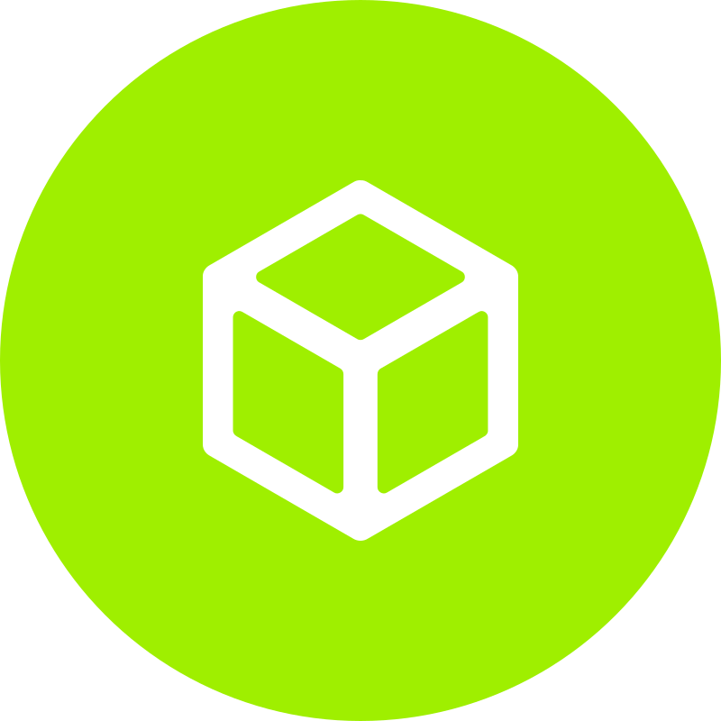

<h1 align="center">
  
</h1>

<h5 align="center">
  <code><a href="https://www.linkedin.com/in/domsec/" title="LinkedIn Profile"> LinkedIn</a></code>
  <code><a href="https://www.hackerrank.com/DomSecRocks" title="HackerRank Profile"> HackerRank</a></code>
  <code><a href="https://twitter.com/domsecrocks" title="Twitter Profile"> Twitter</a></code>
  <code><a href="https://domsec.rocks" title="Personal Website"> Website</a></code>
  <code><a href="https://discord.gg/HexRays" title="HexRays Discord"> Discord</a></code>
  <code><a href="https://app.hackthebox.com/profile/49959" title="Hack The Box Profile"> Hack The Box</a></code>

</h5>
 

  Hi, I'm Dom *******, Principal Security Consultant, Red Team Operator, and Aspiring Offensive Developer.
   
   
  🔬 I'm currently studying for offensive certificates including the OSCP, CRTO, and the OSWE.
   
  🎓 In my day job, I do all aspects of penetration testing and threat modeling for a small startup.
   
  🎓 At night, I try to improve skills in various aspects of technology, particularly cybersecurity and developmenet.
   
  💻 In my spare time, I pick locks, read books, cook, and work out.  
   
  📚 I’m currently learning RUST and Nim for offensive tooling. Hoping to build my first C2 by then end of the year.
   
  💬 Ask me anything about from <a href="https://github.com/dom-sec/dom-sec/issues" title="Issues">Here</a>
   
  📫 Connect with me: <a href="mailto: domsecrocks@protonmail.com">domsecrocks@protonmail.com</a>

<h2 align="center">🔥 Languages & Frameworks 🔥</h2>
 

  <code></code>
  <code></code>
  <code></code>
  <code></code>
  <code></code>
  <code></code>
  <code></code>
  <code></code>
  <code></code>
  <code></code>
  <code></code>
  <code></code>
  <code></code>
  <code></code>
  <code></code>
  <code></code>
  <code></code>
  <code></code>
  <code></code>
  <code></code>
  <code></code>
  <code></code>
  <code></code>

<h2 align="center">🔥 Tools & Abilities 🔥</h2>
 

  <code></code>
  <code></code>
  <code></code>
  <code></code>
  <code></code>
  <code></code>
  <code></code>
  <code></code>
  <code></code>
  <code></code>
  <code></code>
  <code></code>
  <code></code>

<h2 align="center">⚡ Stats ⚡</h2>
 

  

    
    
  

           
  

    
  

   
  
  

